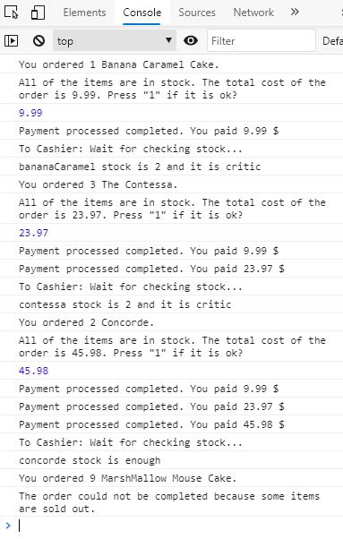

# KEK SİPARİŞİ

Pastane Pasta Siparişi sayfası işlevselliğini oluşturun.
3 adımınız var;
• Sipariş (stok onayı ile) alma ve ödeme hesaplama,
• Ödeme onayı,
• Kalan stok kontrolü.

Bu işlevi yapmak için, ayrı vaatler kullanın ve ardından düğme "tıklama" işleyicinizde zincire söz verin.

**Adımlar:**

1. Giriş argümanı olarak DOM öğelerinden sıra alan bir işlev '`ckeckOrder`' oluşturun (bir dizide veya ayrı olabilir).
   Bu fonksiyon, stok ile sipariş karşılaştıran yeni bir söz döndürür, uygunsa toplam ödemeyi hesaplayın ve kullanıcı için konsola bir mesaj yazın.
2. Ayrıca, '`ckeckOrder`' işlevi, sipariş ve toplam ödemeyi birlikte çözer.

Bir hata mesajı olması durumunda, vaadi reddedin.

3. '`ckeckOrder`' işlevinden sipariş ve toplam ödeme gönderimini alan bir '`payment`' işlevi oluşturun. Ve yeni Promise döndürür.
4. Bu işlev, kullanıcıdan onay ister (seçilen bir tuşa basarak); Uygunsa, "ödeme tamamlandı" dizesini yazdırır ve siparişi kendisi çözer.
5. Bir fonksiyon oluşturun '`checkStock`' yeni Promise döndürür. Sipariş edilen ürünün kalan stokunu kontrol eder. Kritik ise (sadece bir tane kaldı veya tükendi), pastane için bir mesaj yazdırır.
6. Bir söz zinciri oluşturun; sipariş ile '`ckeckOrder`' işlevini çağırarak başlayın ve `.then` ve `.catch `yöntemlerini oluşturun. (`.thens` içindeki diğer işlevlerinizi arayın)
7. Her fonksiyon, yukarıdakinden en az 1 saniye gecikmeli bir zaman aşımı fonksiyonuna sahip olmalıdır.

### İpucu;

> Diğer sayfadaki örnek çıktı ekran görüntüsüne bakın.

---

**CAKE ORDER**

Build the Patisserie Cake Order page functionality.

You have 3 steps;

·
Take order (with stock
confirmation) and payment calculation,

·
Payment approval,

·
Remaining stock control.

To do that functionality, use seperate promises and then promise chain
in your button “click” handler.

STEPS:

**1.**         Create a
function 'ckeckOrder' which receives order
from DOM elements as an input argument (may be in an array or seperate).

This function returns a new promise which compare stock wih order, if it
is ok calculate total payment and write a message on the console for user.

**2.**         Also, 'ckeckOrder' function resolves order and total
payment together.

In case there is an error message, reject the promise.

**3.**         Create a
’payment’ function which receives order
and total payment send from 'ckeckOrder'
function. And returns new Promise.

**4.**         This
function asks user for confirmation (pressing a selected key); If it is ok, it
prints a “payment completed” string and resolves order
itself.

**5.**         Create a
function 'checkStock' returns new
Promise. Controls the remaining stock of the item ordered. If it is critical (left
only one or sold out), it prints a message for patisserie shop.

**6.**         Create a
promise chain; start with calling 'ckeckOrder'
function with the order and create .then
and .catch methods. (call your other
functions within .thens)

**7.**         Every
function should have a timeout function
with the delay of at least 1 second then the above.

HINT:

Look at the sample output screenshot on
the other page.

